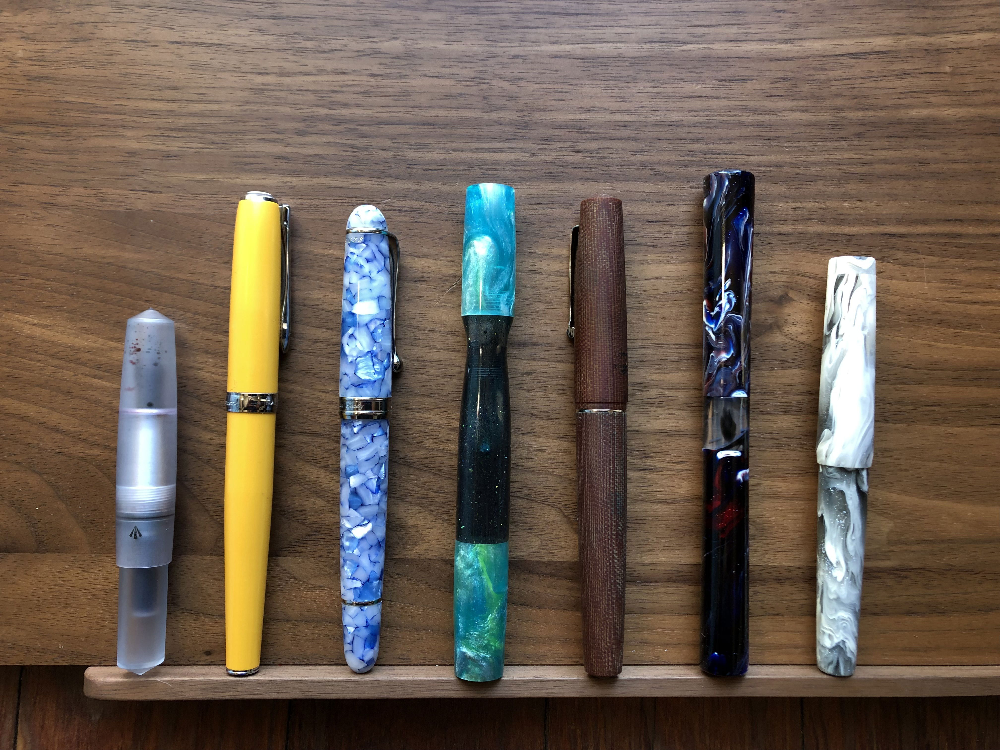

I had the comforting notion that I had slowed down my fountain pen purchases this year and was building appreciation for those pens I already had. Then I consulted [the database][fpc] and discovered that I acquired 7 pens this year, which means that pens from this year constitute nearly 25% of my current collection. 

Here they are from left-to-right. 

- Gravitas Polycarbonate Pocket Dropper - a gift from a friend who I've been pulling down the fountain pen rabbit hole with me. He ordered this as a Christmas present in 2022 and was able to give it to me in April the following year
- Diplomat Excellence A2 - purchased at the Atlanta pen show from the Yafa table. I had my eye on this one but they didn't have a fine nib available, so they sold me one with a 14K fine nib for an excellent price. After a tweak from Gina at Custom Nib Studios been using this daily at work
- Aurora 88 Viaggio Segreto Italia Matera - I absolutely adore the other Aurora 88 I own, so I couldn't resist a good deal on this pen from Endless Pens
- Mayfair Pens Simaril "Atlantis" combining blanks of that given name from Turnt Pen Co and Stormwinds Blank - An impulse purchase from the Penaddict slack that completely surprised me. Despite the unusual shape, it really works well for me. 
- Leonardo x Stilo e Stile Momento Zero Micarta - Leonardo continues to be one of my favorite pen makers and the Micarta material gave me a good excuse to get yet one more. It took a while for me find the right use for this but I've got an EF nib in it inked with boring old Pilot Black and using it nightly for journaling in my 5-year Hobonichi. 
- Edison Extended Mina Level in Brooks Nebula - I acquired this second-hand without realizing it uses a #5 nib. Ooops. Writes very well but I may be passing this one on in the coming year. 
- Edison Brockton in Fubuki Koi - My most recent acquisition one, a second swing after my first Edison goof. Brook's Fubuki Koi is such a mesmerizing material, and I've been on the hunt for the right pen to show it off. I hadn't heard much about the Brockton model but I love the compact shape. 

[fpc]: http://www.fpc.ink/users/1305